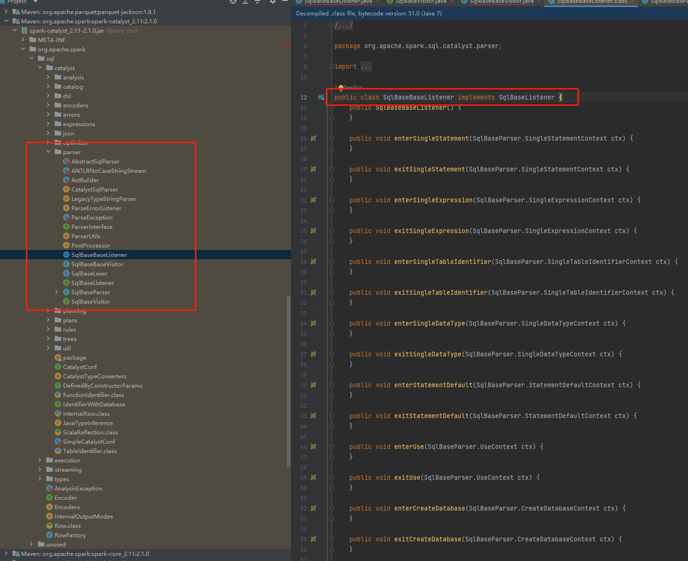

# 探寻SQL的背后机制

前言
-------------

在数据领域，SQL（Structured Query Language）是一门广泛使用的语言，用于查询和处理数据。你可能已经使用过诸如MySQL、Hive、ClickHouse、Doris、Spark和Flink等工具来编写SQL查询。

每一种框架都提供了对应的SQL语法，可以帮助我们从庞大的数据集中提取所需的信息，但你是否思考过他们的SQL查询是如何一步一步变成底层的执行结果的呢？

这正是本文将要探讨的问题。将由浅入深了解SQL语法的背后原理，揭示SQL查询是如何读取、翻译、处理、和最终执行。

这一切都得益于一个强大的工具——语法解析器。


语法解析器
-----

### 介绍

SQL（Structured Query Language）是数据领域中的关键工具，用于查询和操作数据库中的数据。然而，SQL查询并非像魔术一样自动执行的。在执行之前，SQL语句需要经过一个关键步骤：语法解析。

SQL语法解析是SQL查询处理的起点，它的任务是将人类可读的SQL语句转换为计算机可以理解的结构，以便进一步执行。这个过程依赖于语法解析器，它是一种软件工具，负责解释和分析SQL查询，以确保其具有正确的语法。

举个例子，想象一下，如果我们自己发明了一种特殊的SQL语言，例如我们将其命名为GlSQL，其语法规则如下：

``` sql
-- 查询tableA表的前十条记录的a、b、c字段
gl a, b, c to tableA head 10;
```

可以想象，市面上没有其他人使用这种特殊语法，因为它是我们自己创造的。如果我们希望这种语言能够成熟且优雅地发展，我们需要解决以下两个核心问题：

1.  **词法解析**：词法解析是指将文本转化为词法单元或标记，即将关键字和符号识别出来。

2.  **语法解析**：语法解析是将这些词法单元按照特定规则组合成正确的语句结构。


这种自定义语法的语言被称为“领域特定语言”（DSL）。然而，要手动实现DSL的词法解析和语法解析过程相当复杂，需要字符串解析、语法树构建、节点处理等多个步骤，如下图：


这时，成熟的语法解析器派上了用场。它们能够自动执行这些繁琐的任务，大大简化了DSL的开发过程。这也是语法解析器的关键作用。


### 市面上常见的语法解析器

市场上有多个SQL语法解析器，每个都具有独特的特点和能力:

1.  **ANTLR (ANother Tool for Language Recognition):** ANTLR 是一种强大的语法解析器生成器，支持多种编程语言。它能够生成用于词法分析和语法解析的解析器，广泛用于生成编程语言解析器、配置文件解析器、模板引擎等。

2.  **JavaCC（Java Compiler Compiler）**是一个用于构建解析器（Parser）和词法分析器（Lexer）的工具，它专注于生成 Java 代码。JavaCC 提供了一种定义和生成解析器的方式，使你能够将自定义的语法规则转化为 Java 代码，以便解析和处理特定领域语言（DSL）或文件格式。

3.  **ANTLR 4 和 JavaCC:** 这两者都支持 Java 语言，并在 Java 开发领域中广泛使用。ANTLR 4 的优势之一是它支持多种语言，而 JavaCC 主要专注于 Java。选择取决于项目的需求和开发人员的偏好。

4.  **Calcite:** Apache Calcite 是一种灵活的开源框架，用于构建自定义 SQL 解析器和优化器。它是 Apache Flink、Apache Hive 和其他项目的一部分，用于处理 SQL 查询。Calcite 允许用户定义自己的 SQL 方言，并进行查询优化。


Antlr4
------

### 介绍

ANTLR (ANother Tool for Language Recognition) is a powerful parser generator for reading, processing, executing, or translating structured text or binary files. It's widely used to build languages, tools, and frameworks. From a grammar, ANTLR generates a parser that can build and walk parse trees.

ANTLR(另一个语言识别工具)是一个功能强大的解析器生成器，用于读取、处理、执行或翻译结构化文本或二进制文件。它被广泛用于构建语言、工具和框架。从语法中，ANTLR生成一个可以构建和遍历解析树的解析器。

### 市场应用

ANTLR 4被许多知名的企业和项目广泛使用。这些企业和项目包括：

1.  **Twitter:** Twitter 使用ANTLR来解析和分析用户的查询语言，这有助于他们的搜索和分析功能。

2.  **IBM:** IBM使用ANTLR来支持一些其产品和工具中的DSL（领域特定语言）解析需求，例如，在其企业集成解决方案中。

3.  **Apache Hive:** Apache Hive，用于大数据分析，也使用ANTLR来解析Hive查询语言。

4.  **Apache Spark:** Apache Spark，流行的大数据处理框架，使用ANTLR作为其SQL解析器的一部分，支持SQL查询。

5.  **Apache Solr:** Apache Solr是一个开源搜索平台，它使用ANTLR来解析查询表达式以进行高级搜索。


### 使用方式

ANTLR 4主要用于生成解析器和分析器，可以将这些生成的代码集成到自己的项目中。下面是一些与ANTLR 4相关的使用方式：

1.  **通过pip下载ANTLR 4运行时库：** 使用pip（Python的包管理工具）下载ANTLR 4的运行时库，以便在Python项目中使用ANTLR 4生成的解析器。安装ANTLR 4运行时库后可以将其导入并在Python代码中使用。

2.  **下载源码并使用命令行工具**：可以下载 ANTLR4 的源码，并使用命令行工具来编译和运行它。这需要手动设置一些环境变量，并了解如何使用命令行工具来编译和运行 ANTLR4。

3.  **在IDE中使用ANTLR 4插件及三方库：** ANTLR 4有官方支持的IDE插件，如ANTLRWorks和ANTLR4 Grammar Plugin for IntelliJ IDEA。可以使用这些插件来创建和编辑ANTLR 4语法文件，然后生成解析器和词法分析器的代码。这些插件通常提供可视化工具来帮助我们调试和测试语法规则。


### 安装插件

首先需要在IDEA中安装antlr4插件，ANTLR 4插件对于在InIDEA中使用ANTLR 4非常有用，尤其是在处理ANTLR语法文件、生成代码以及进行调试时，如下图：


### 编写语法文件

ANTLR4使用.g4语法文件作为输入，这些文件定义了一种形式化的语法规则，描述了编程语言、数据格式或通用文本输入的结构。

开发人员根据目标语言的数据格式和语法规则，编写.g4文件。这些规则定义了输入文本的结构，如词法分析器（lexer）和语法分析器（parser）的规则，如下：

``` g4
// 语法文件通常以 granmar 关键子开头 这是一个名为 JsonParser 的语法 它必须和 JsonParser.g4文件名相匹配
grammar JsonParser;

// 定义一条名为 json 的语法规则，它匹配一对花括号[START, STOP为词法关键词]、逗号分隔的 value [另一条语法规则，在下面], 以及 * 匹配多个 value
json : START value (',' value)* STOP ;

// 定义一条value的语法规则，正是上面json语法中的value，该value的值应该是 INT 或者继续是 json [代表嵌套], | 符号代表或
value :
      |json
      |INT
      ;

// 以下所有词法符号都是根据正则表达式判断
// 定义一个INT的词法符号, 只能是正整数
INT : [0-9]+ ;

// 定义一个START的词法符号, 只包含{
START : '{' ;

// 定义一个STOP的词法符号, 只包含}
STOP : '}' ;

// 定义一个AND的词法符号, 只包含,
AND : ',' ;
```


这是一个经典的ANTLR4的语法文件示例，用于解析JSON格式的数据，此时我们运行antlr4插件简单测试一下，如下：在语法文件中右键跟节点-> Test Rule json


在左侧输入框中输入特定语法右侧即会展示语法树，如下：


至此我们从理论层面初步体验了Antlr4的语法解析过程，接下来要结合代码使用

### 生成Java解析类

在上一步中，我们仅使用IDEA的Antlr4插件来验证了语法文件，但光有语法文件是不够的，实际应用中我们需要将其与代码结合起来并进行实际操作，而生成代码这一步骤也可以通过Antlr4插件来实现，首先需要指定Antlr4插件生成java类的路径，如下：右键JsonParser.g4 -> Configure


- 生成java文件


此时生成的java类便是Antlr4所提供的核心功能，将AST语法树转化成类的表达方式，新建一个测试类复制如下代码：

``` java
import org.antlr.v4.runtime.ANTLRInputStream;
import org.antlr.v4.runtime.CommonTokenStream;
import org.antlr.v4.runtime.tree.ParseTree;
import org.junit.Test;

public class Example {

    @Test
    public void demo() {

        ANTLRInputStream input = new ANTLRInputStream("{1,2,{3,4}}");
        //词法解析器，处理input
        JsonParserLexer lexer = new JsonParserLexer(input);
        //词法符号的缓冲器，存储词法分析器生成的词法符号
        CommonTokenStream tokens = new CommonTokenStream(lexer);
        //语法分析器，处理词法符号缓冲区的内容
        JsonParserParser parser = new JsonParserParser(tokens);

        ParseTree tree = parser.json();
        System.out.println(tree.toStringTree(parser));
    }

}
```


在ParseTree中包含着children集合，在集合中抱着各个节点，每个节点又可以向下展开，从而形成类形式的语法树，如下：


### 自定义处理规则

在上一步中Antlr4帮我们将{1,2,{3,4}}字符串转化成了类形式的语法树，Antlr4生成的语法树只是一种理解和解析语言结构的方式，真正的业务逻辑处理还需要在语法树的基础上进行。就拿sql举例，sql语言解析成了语法树是远远不够的，还需要让语法树落地成读取物理文件的可执行的代码。

假设我们现在的规则是需要将{}中的所有数值相加求和，最后得到总和，那么该如何自定义呢？

*   Antlr4给我们提供了两种遍历树的方式：


*   1、监听器模式–antlr4内部控制遍历语法树规则

*   2、访问者模式—用户可以手动控制遍历语法树规则


这两种方式在此示例中的体现是两个接口【antlr4帮我们生成】，并且还帮我们生成了默认实现类：


### 监听器模式

监听器模式的特点是用户无需关心语法树的递归，统一由antlr提供的ParseTreeWalker类进行递归即可。

我们先自行实现ParseTreeListener接口，在其中填充自己的逻辑代码（通常是调用程序的其他部分），从而构建出我们自己的语言类应用程序，如下：

``` java
import org.antlr.v4.runtime.ParserRuleContext;
import org.antlr.v4.runtime.tree.ErrorNode;
import org.antlr.v4.runtime.tree.TerminalNode;

import java.util.HashMap;
import java.util.Map;

public class JsonParserListenerExample implements JsonParserListener {

    Map<String, Integer> map = new HashMap<>();

    @Override
    public void enterJson(JsonParserParser.JsonContext ctx) {
        if (!map.containsKey(ctx.getText())) {
            map.put(ctx.getText(), 0);
        }
    }

    @Override
    public void exitJson(JsonParserParser.JsonContext ctx) {
        if (ctx.parent == null) {
            int sum = map.values().stream().mapToInt(i -> i).sum();
            System.out.println(" result = " + sum);
        }
    }

    @Override
    public void enterValue(JsonParserParser.ValueContext ctx) {
        if (ctx.INT() != null && map.containsKey(ctx.parent.getText())) {
            map.put(ctx.parent.getText(), map.get(ctx.parent.getText()) + Integer.parseInt(ctx.INT().getText()));
        }
    }

    @Override
    public void exitValue(JsonParserParser.ValueContext ctx) {

    }
}
```


*   测试：

``` java
@Test
public void demoListener(){

    ANTLRInputStream input = new ANTLRInputStream("{1,2,{3,4},{3,4}}");
    //词法解析器，处理input
    JsonParserLexer lexer = new JsonParserLexer(input);
    //词法符号的缓冲器，存储词法分析器生成的词法符号
    CommonTokenStream tokens = new CommonTokenStream(lexer);
    //语法分析器，处理词法符号缓冲区的内容
    JsonParserParser parser = new JsonParserParser(tokens);

    ParseTree tree = parser.json();
    // ParseTreeWalker类将实现的MeSqlParserBaseListener监听器放入
    new ParseTreeWalker().walk(new JsonParserListenerExample(), tree);
}
```


这里说一下执行流程：

在JsonParserListenerExample类中，语法中的每条规则都有对应的enter方法和exit方法。

例如，当遍历器访问到json规则对应的节点时，它就会调用enterJson（）方法，然后将对应的AST语法树节点 JsonContext的实例当作参数传递进去，在遍历器访问了Json节点的全部子节点之后，它会调用exitJson（）函数；

如果执行到叶子节点，它会调用enterValue（）方法，将对应的语法树节点 ValueContext的实例当作参数传递给它，执行完成后执行exitValue（）方法。

下图用标识了 ParseTreeWalker对AST语法树进行深度优先遍历的过程：


**至此监听器程序结束。**


##### 访问者模式

访问者模式是23种设计模式中最复杂的模式，可参考：[23-design-pattern](https://github.com/LightGao-Hub/23-design-pattern/blob/master/src/test/java/org/example/design/behavioral/visitor/complete/TestComplete.java)

访问者模式的特点是需要用户自己手动控制语法树节点的调用，优点是灵活，sparksql也是使用这一模式来实现sql语法解析

在JsonParserVisitorExample中，语法里的每条规则对应接口中的一个visit方法

``` java
import org.antlr.v4.runtime.tree.ErrorNode;
import org.antlr.v4.runtime.tree.ParseTree;
import org.antlr.v4.runtime.tree.RuleNode;
import org.antlr.v4.runtime.tree.TerminalNode;

import java.util.List;

public class JsonParserVisitorExample implements JsonParserVisitor<Integer> {

	@Override
	public Integer visitJson(JsonParserParser.JsonContext ctx) {
		List<JsonParserParser.ValueContext> value = ctx.value();
		return value.stream().mapToInt(this::visitValue).sum();
	}

	@Override
	public Integer visitValue(JsonParserParser.ValueContext ctx) {
		if (ctx.json() != null) {
			return visitJson(ctx.json());
		}
		if (ctx.INT() != null) {
			return Integer.parseInt(ctx.INT().getText());
		}
		return 0;
	}

	@Override
	public Integer visit(ParseTree parseTree) {
		return null;
	}

	@Override
	public Integer visitChildren(RuleNode ruleNode) {
		return null;
	}

	@Override
	public Integer visitTerminal(TerminalNode terminalNode) {
		return null;
	}

	@Override
	public Integer visitErrorNode(ErrorNode errorNode) {
		return null;
	}
}
```


*   测试：

``` java
@Test
public void demoVisitor() {

    ANTLRInputStream input = new ANTLRInputStream("{1,2,{3,4},{3,4}}");
    //词法解析器，处理input
    JsonParserLexer lexer = new JsonParserLexer(input);
    //词法符号的缓冲器，存储词法分析器生成的词法符号
    CommonTokenStream tokens = new CommonTokenStream(lexer);
    //语法分析器，处理词法符号缓冲区的内容
    JsonParserParser parser = new JsonParserParser(tokens);

    JsonParserVisitorExample jsonParserVisitorExample = new JsonParserVisitorExample();
    Integer sum = jsonParserVisitorExample.visitJson(parser.json());
    System.out.println(sum);
}
```


**至此访问者模式结束。**


### 使用总结

**至此我们用两种方式实现了一个简单的DSL语言，回过头来再看一下开篇定义：**

**ANTLR是一款强大的语法分析器生成工具，可用于读取、处理、执行和翻译结构化的文本，用户可根据需要自定义语法规则来实现相应功能。**


SparkSql中的应用
------------

### 语法

*   这里以sparkSql:3.0为例，语法文件地址：[SqlBase.g4](https://github.com/apache/spark/blob/v3.0.0/sql/catalyst/src/main/antlr4/org/apache/spark/sql/catalyst/parser/SqlBase.g4)

*   接下来我们将这该文件复制到IDEA中，打开SqlBaseParser.g4，右键执行Test Rule


*   随便输入一条sql，查看右侧语法树：可以看到右侧生成了庞大的语法树，这就是SparkSQL的语法树


*   接下来我们可以根据语法文件来生成相关配置类：


*   此时我们查看工程中spark-catalyst依赖的parser包，可以看出两者完全一样




*   由于sparksql是通过访问器模式实现递归调用语法树，故这里看SqlBaseBaseVisitor，发现真正实现的是子类：AstBuilder、SparkSqlAstBuilder，其内部实现函数便是sparksql各个节点的执行逻辑


### 示例

*   接下来我们试着改一下Spark的Sql语法，新建一个类来自定义访问器

``` java
public class SqlBaseVisitorExample extends SqlBaseBaseVisitor<String> {
    @Override
    public String visitSingleStatement(SqlBaseParser.SingleStatementContext ctx) {
        System.out.println(" ...SqlBaseVisitorExample... "); // 打印
        return visitChildren(ctx);
    }
}
```


*   测试类

``` java
import org.antlr.v4.runtime.ANTLRInputStream;
import org.antlr.v4.runtime.CommonTokenStream;
import org.junit.Test;

public class Example {

    @Test
    public void demoVisitor() {
        String query = "SELECT * FROM STUDENT WHERE ID > 10;";
        SqlBaseLexer lexer = new SqlBaseLexer(new ANTLRInputStream(query.toUpperCase()));
        SqlBaseParser parser = new SqlBaseParser(new CommonTokenStream(lexer));

        // 创建自定义访问器
        SqlBaseVisitorExample visitor = new SqlBaseVisitorExample();
        // 将parser语法树头节点放入
        visitor.visitSingleStatement(parser.singleStatement());
    }

}
```


**至此SparkSql中涉及antlr4语法解析器阶段结束**


相关文档
----

*   [ANTLR4官网](https://www.antlr.org/index.html)

*   [ANTLR4-GitHub](https://github.com/antlr/antlr4)

*   [SPARK官网](https://spark.apache.org)

*   [SPARK-GitHub](https://github.com/apache/spark)

*   [23种设计模式](https://github.com/LightGao-Hub/23-design-pattern)
