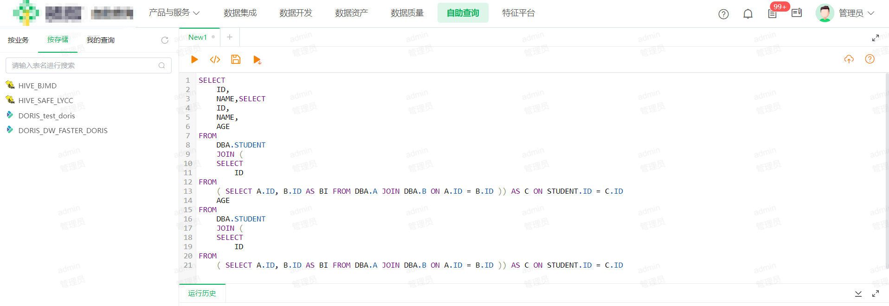
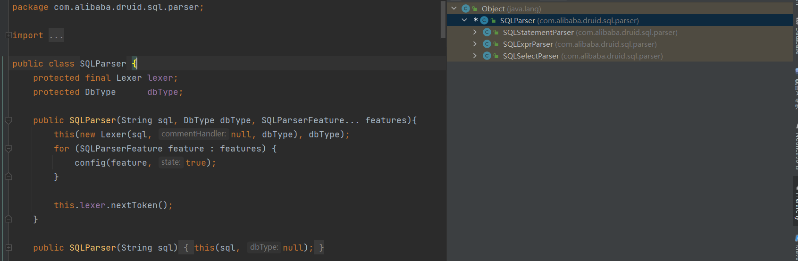
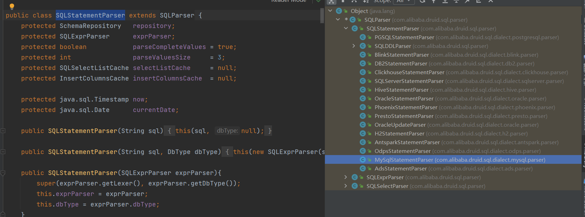
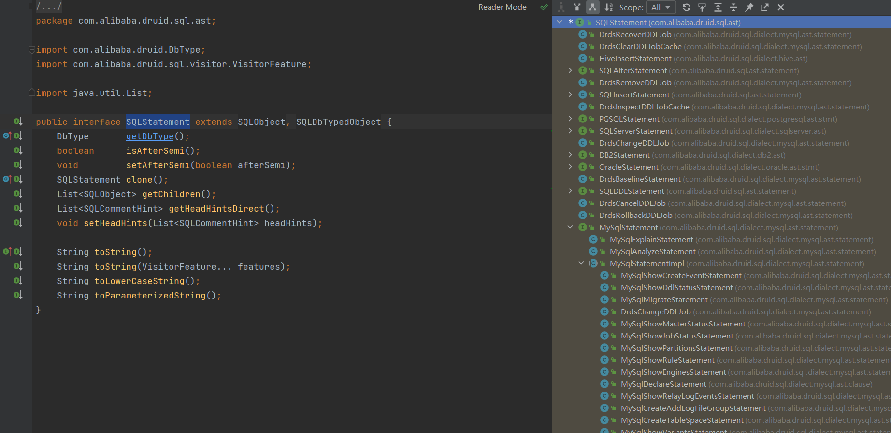
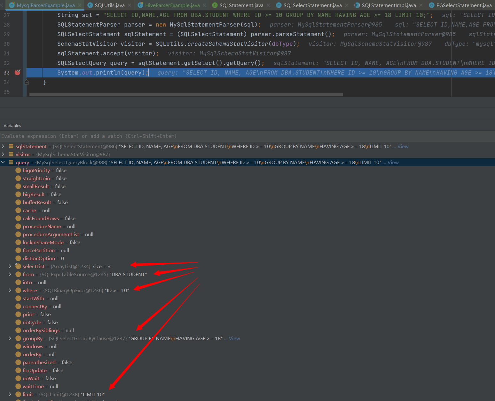
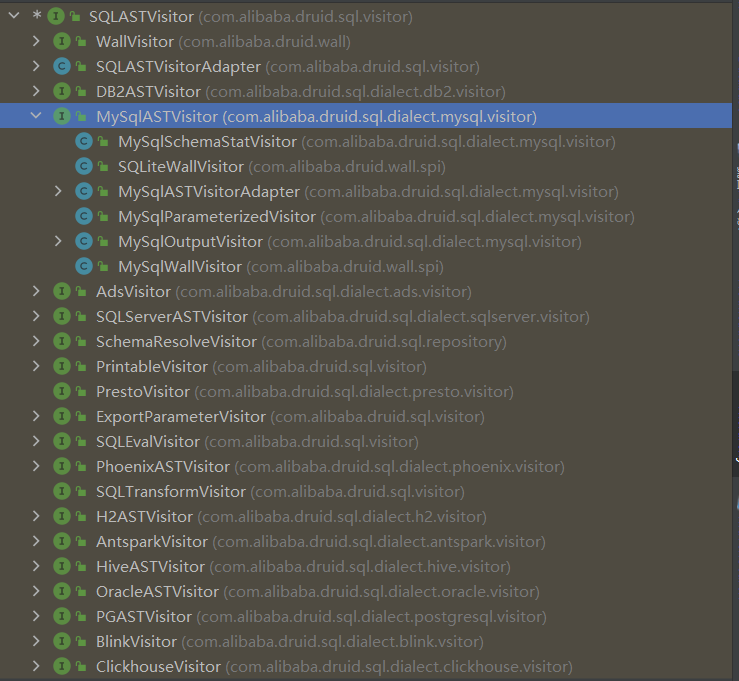
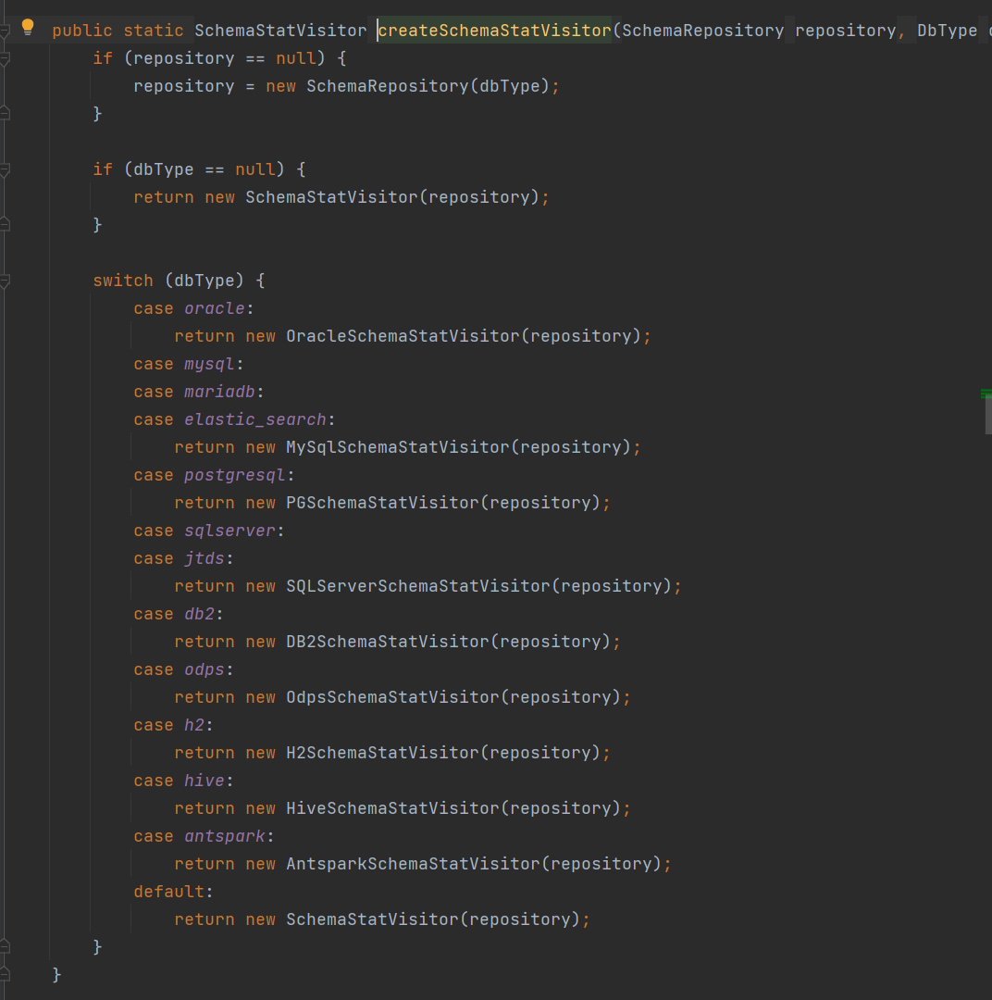

# 轻松操纵SQL：Druid解析器实践

# 一、背景

在BI（Business Intelligence）场景中，用户会频繁使用SQL查询语句，但在平台运作过程中，面临着权限管理、多数据源处理和表校验等多种挑战。

例如，用户可能不清楚自身是否具备对特定表（如下图DBA.STUDENT）的访问权限。因为平台不会限制用户编写自定义SQL的能力，故需要后端开发团队可以利用技术手段来解析SQL，提取其中的表名并作出相应处理。

尤其对于涉及多表连接、子查询以及使用别名等复杂SQL语句，准确提取表名变得至关重要。这时，利用SQL语法树解析就成为必不可少的关键环节。

幸运的是，我们常用的数据库连接池——Druid，提供了便捷的接口，使得解析SQL语句变得更加轻松。本文将探讨Druid在SQL语句解析中的关键作用及应用。




# 二、Druid

Druid是一种用于Java应用程序的高性能数据库连接池。它是阿里巴巴开源的项目之一，旨在提供高效的数据库连接池管理和监控功能。Druid为应用程序提供了对数据库连接的管理，可以对连接的状态、使用情况进行跟踪和监控，并且可以有效地管理连接的生命周期。

除了作为连接池外，Druid还提供了诸如SQL语句解析、性能监控、SQL防火墙、数据加密、统计分析等功能。它是一个全面的数据库中间件解决方案，为开发者提供了一系列丰富的工具和功能，以提高应用程序与数据库的交互效率和可靠性。

总之，Druid是一种功能强大的Java数据库连接池，为开发者提供了高性能、高可靠性、丰富的监控和管理功能，用于优化应用程序与数据库之间的交互。


# 三、简单示例

- 千言万语不如简单示例，让我们先通过一个简单的例子来演示Druid SQL Parser的使用

## 3.1、Maven

``` xml
<dependency>
    <groupId>com.alibaba</groupId>
    <artifactId>druid</artifactId>
    <version>1.2.0</version>
</dependency>
```


## 3.2、解析表名

- 代码：使用 `getTables()` 函数可获取所有表的声明类，并输出各表的名称以及相应的 SQL 操作类型。

``` java
import java.util.*;

import com.alibaba.druid.DbType;
import com.alibaba.druid.sql.SQLUtils;
import com.alibaba.druid.sql.ast.SQLStatement;
import com.alibaba.druid.sql.dialect.mysql.parser.MySqlStatementParser;
import com.alibaba.druid.sql.parser.SQLStatementParser;
import com.alibaba.druid.sql.visitor.SchemaStatVisitor;
import com.alibaba.druid.stat.TableStat;
import com.alibaba.druid.stat.TableStat.Name;
import com.alibaba.druid.stat.TableStat.Column;

import org.junit.Test;


public class MysqlParserExample {

    private final DbType dbType = DbType.mysql;

    @Test
    public void parserTables() {
        // 复杂嵌套sql
        String sql = "SELECT ID,NAME,AGE FROM DBA.STUDENT JOIN (\n" +
                "SELECT ID FROM (\n" +
                "SELECT A.ID,B.ID AS BI FROM DBA.A JOIN DBA.B ON A.ID=B.ID)) AS C ON STUDENT.ID=C.ID";
        SQLStatementParser parser = new MySqlStatementParser(sql);
        SQLStatement sqlStatement = parser.parseStatement();
        SchemaStatVisitor visitor = SQLUtils.createSchemaStatVisitor(dbType);
        sqlStatement.accept(visitor);
        Map<Name, TableStat> tables = visitor.getTables();
        for (Map.Entry<TableStat.Name, TableStat> tableStatEntry : tables.entrySet()) {
            System.out.println("表名：" + tableStatEntry.getKey().getName());
            System.out.println("操作名：" + tableStatEntry.getValue());
        }
    }

}
```


- 打印：表名及操作名

``` shell
表名：DBA.STUDENT
操作名：Select
表名：DBA.A
操作名：Select
表名：DBA.B
操作名：Select
```


## 3.2、解析字段

- 代码：使用 `getColumns()` 函数能够获取 SQL 中涉及的所有字段信息，并能输出字段的名称、类型以及相关的表名。

```java
private final DbType dbType = DbType.mysql;

@Test
public void parserColumns() {
    String sql = "CREATE TABLE users (\n" +
            "    user_id INT AUTO_INCREMENT PRIMARY KEY,\n" +
            "    username VARCHAR(50) NOT NULL,\n" +
            "    email VARCHAR(100) NOT NULL,\n" +
            "    created_at TIMESTAMP DEFAULT CURRENT_TIMESTAMP\n" +
            ");\n";
    SQLStatementParser parser = new MySqlStatementParser(sql);
    SQLStatement sqlStatement = parser.parseStatement();
    SchemaStatVisitor visitor = SQLUtils.createSchemaStatVisitor(dbType);
    sqlStatement.accept(visitor);
    Collection<Column> columns = visitor.getColumns();
    for (Column column : columns) {
        System.out.println("字段：" + column.getName());
        System.out.println("字段类型：" + column.getDataType());
        System.out.println("表名：" + column.getTable());
    }
}
```


- 打印：

``` shell
字段：user_id
字段类型：INT
表名：users
字段：username
字段类型：VARCHAR
表名：users
字段：email
字段类型：VARCHAR
表名：users
字段：created_at
字段类型：TIMESTAMP
表名：users
```


# 四、核心模块

## 4.1、介绍

Druid提供了三个关键类，它们在处理和分析SQL语句中起着关键作用：

1. **SQLParser**：这个类是解析SQL语句的入口点。它接收原始的SQL字符串并将其转换为一个抽象语法树（AST），为后续处理和分析做好准备。
2. **SQLStatement**：代表着SQL语句的抽象语法树。SQLStatementParser解析SQL语句后生成的结果就是这个抽象语法树。它提供了对SQL语句结构的抽象化描述。
3. **SQLASTVisitor**：这个类用于访问和遍历SQL语句的抽象语法树。通过使用SQLASTVisitor，您可以从SQL语句中提取出涉及的表、字段等信息。


## 4.2、SQLParser

SQLParser是用于将输入文本转换为AST（抽象语法树）的工具。它主要包含两个部分：Parser和Lexer。Lexer负责词法分析，而Parser则负责语法分析。Lexer用于将输入文本分解为词法单元（tokens），如下图：




SQLStatementParser是用于语法解析的关键类，在上面示例中已经使用过。这个类拥有许多子类，根据不同的下游数据库类型，需要选择相应的实现类进行使用，如下：




> 如果我们要解析hiveSql，就需要创建对应的HiveStatementParser


## 4.2、SQLStatement

SQLStatement 类的实例可以根据 SQL 语句的类型，如 SELECT、INSERT、UPDATE、DELETE 等，来保存对应的语法树节点。这意味着在 Druid 中，SQLStatement 的子类对象会根据 SQL 语句的不同类型分别表示不同的操作，每个子类都对应着该 SQL 类型的语法结构。

例如，如果解析的是一个 SELECT 语句，那么 SQLStatement 的实例将是 SQLSelectStatement 类的对象，它会保存与 SELECT 语句相关的语法树节点，如查询的列、表名、条件等信息。

对于 INSERT、UPDATE、DELETE 等不同类型的 SQL，Druid 会根据语句类型解析出对应的 SQLStatement 子类对象，从而以统一的数据结构表示各种 SQL 语句的语法树，如下图：




- 可以看出SQLStatement类提供的接口函数有限，故在实际开发中往往会根据sql类型自行强转后操作，例如：

``` java
@Test
public void parserSelect() {
    String sql = "SELECT ID,NAME,AGE FROM DBA.STUDENT WHERE ID >= 10 GROUP BY NAME HAVING AGE >= 18 LIMIT 10;";
    SQLStatementParser parser = new MySqlStatementParser(sql);
    SQLSelectStatement sqlStatement = (SQLSelectStatement) parser.parseStatement();
    SchemaStatVisitor visitor = SQLUtils.createSchemaStatVisitor(dbType);
    sqlStatement.accept(visitor);
    SQLSelectQuery query = sqlStatement.getSelect().getQuery();
    System.out.println(query);
}
```


- 在该示例中，使用 SQLSelectStatement 可以获取 SQLSelectQuery。这个类将 SQL 中的所有操作转换为变量的形式，为开发人员提供了对 SQL 语句中的各个部分进行访问和处理的能力。这种变量形式的表示方式更易于程序分析和处理 SQL 查询，如下:




## 4.3、SQLASTVisitor

在 Druid 中，SQLASTVisitor 接口有多个子类用于不同的 SQL 语句处理和访问需求。这些子类提供了针对不同类型 SQL 语句的访问和解析功能，使得开发人员能够根据具体的 SQL 语法结构进行定制化处理。

以下是 SQLASTVisitor 接口的一些常见子类：

1. SchemaStatVisitor：用于解析 SQL，提取其中的表名、列名和条件等信息，同时还可以统计 SQL 语句中的访问次数、计算结果等。
2. ExportParameterVisitor：用于导出 SQL 参数。
3. WallVisitor：用于对 SQL 进行安全性检查，防止 SQL 注入等安全问题。
4. ExportTableAliasVisitor：用于导出 SQL 表别名。
5. SQLASTOutputVisitor：用于将 SQL 语句输出为字符串。



- 在上面的示例中，我们使用了 `SQLUtils.createSchemaStatVisitor(dbType)` 工具类来创建一个特定数据库类型的 `SchemaStatVisitor` 实例。这种方式允许我们根据特定的数据库类型动态获取对应的实现类，以便进行 SQL 语句的解析和访问，如下：

``` java
    SchemaStatVisitor visitor = SQLUtils.createSchemaStatVisitor(dbType);
```




# 五、结语

在 Drudi 中，SQL 解析是一个强大且重要的功能，它提供了多种工具和类来解析 SQL 语句、访问语法树以及获取详细的 SQL 操作信息。通过了解 Druid SQL 解析的核心类，如 `SQLStatementParser`、`SQLStatement`、`SchemaStatVisitor` 等，我们能够更高效地处理 SQL 相关的任务。

SQL 解析在开发过程中扮演着至关重要的角色。它使得开发人员能够在处理各种类型的 SQL 语句时更加灵活、高效，帮助开发者更好地理解和操作 SQL 语句，提高代码的可读性和可维护性。

尽管 Druid 提供了强大的 SQL 解析功能，但在实际应用中，需要结合具体的业务场景和需求来灵活使用。学习和掌握 Druid SQL 解析功能对于开发者来说是非常有价值的，它可以提高工作效率，帮助更好地应对各种复杂的 SQL 语句处理需求。

持续深入学习和了解 Druid SQL 解析的特性和用法，结合实际项目经验，将会使您在 SQL 处理方面更加熟练，为开发工作带来更多的便利和效率。

